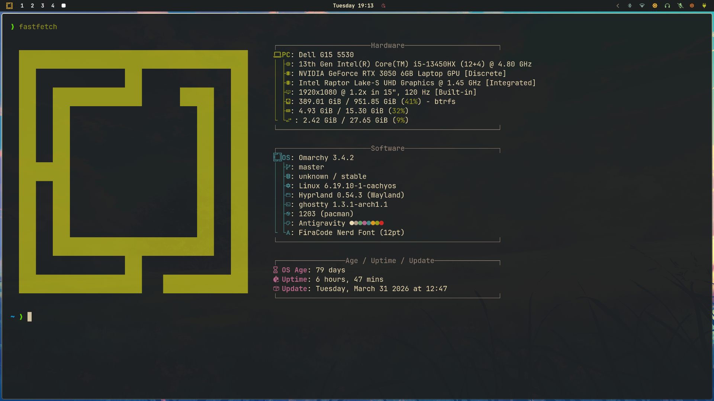
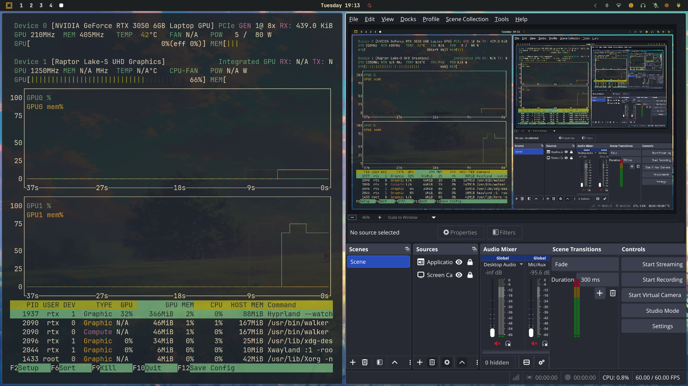
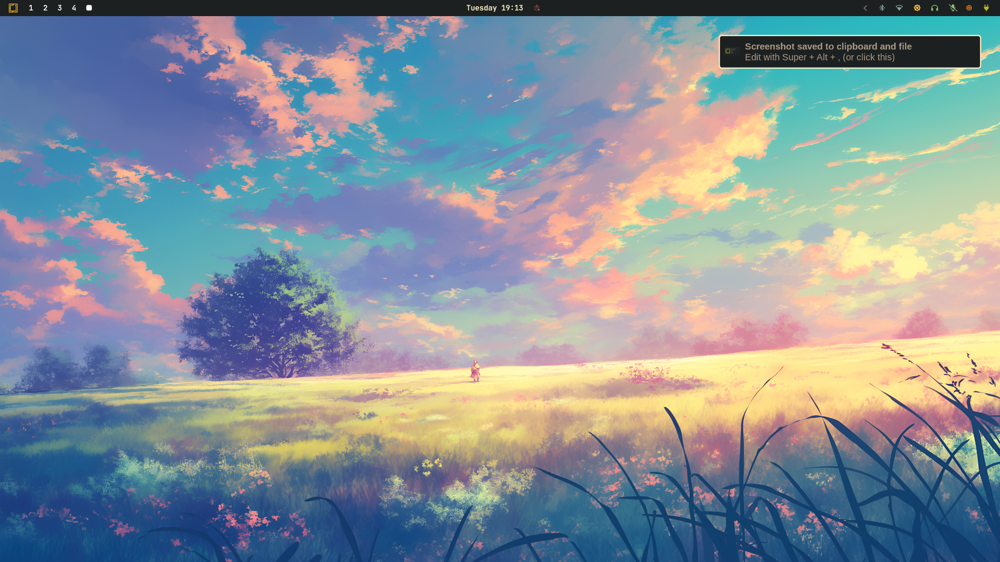

<div align="center">
  <h1>🌌 Antigravity Theme</h1>
  <p>A sleek, modern, and high-contrast <b>Gruvbox Dark Hard</b> aesthetic theme explicitly optimized for <b>Omarchy Linux</b> and <b>Hyprland</b>.</p>

  [](https://opensource.org/licenses/MIT)
  []()
  []()
  []()
  []()
</div>

<br>

<p align="center">
  <b>Antigravity</b> provides a cohesive, eye-friendly, and consistent experience across your entire Linux environment—bridging the legendary Gruvbox color palette with modern Wayland and Hyprland aesthetics.
</p>

---

## 📑 Table of Contents
- [✨ Features](#-features)
- [🎨 Color Palette](#-color-palette)
- [📸 Screenshots](#-screenshots)
- [📦 Supported Applications](#-supported-applications)
- [📂 Repository Structure](#-repository-structure)
- [🚀 Installation](#-installation)
  - [Omarchy native installation](#omarchy-native-installation)
  - [Manual Component Installation](#manual-component-installation)
- [💡 Troubleshooting](#-troubleshooting)
- [🤝 Contributing](#-contributing)
- [📜 License](#-license)

---

## ✨ Features

- **High-Contrast "Gruvbox Dark Hard" Aesthetic:** Completely styled uniformly from terminal emulators to the system monitor.
- **Low RAM Optimization:** The `hyprland.conf` is strictly optimized to minimize compositor overhead, disabling unnecessary blur and heavy shadows for maximal performance.
- **Lean & Smooth Animations:** Custom Bezier curves explicitly tuned to provide buttery macOS-like fade and slide transitions without massive GPU/RAM spikes.
- **Universal GTK Styling:** Deep integration into `gtk.css` ensures apps respect the global layout and color tokens.
- **Comprehensive Terminal Support:** Plug-and-play configs for Kitty, Alacritty, and Ghostty.

## 🎨 Color Palette

The theme strictly adheres to the core Gruvbox color tokens for maximum eye comfort, utilizing high-contrast backgrounds to make neon edges pop.

| Color | Hex Check | Role | Hex Code |
|-------|-----------|------|----------|
| **Background** |  | Main Base UI | `#1d2021` |
| **Foreground** |  | Text / Active Borders | `#ebdbb2` / `#fbf1c7` |
| **Primary Accent** |  | Error / Critical | `#cc241d` |
| **Secondary Accent**|  | Success / Notification | `#b8bb26` |
| **Tertiary Accent**|  | Warnings / UI Elements | `#fabd2f` |
| **Selection BG** |  | Highlight text / borders | `#a89984` |

*See `colors.toml` for the full terminal ANSI mappings.*

## 📸 Screenshots

<p align="center">
  
  <br><i>Fastfetch showcasing the Antigravity theme details and Gruvbox palette in the terminal.</i>
</p>

<p align="center">
  
  <br><i>System resource monitoring alongside OBS Studio under Hyprland.</i>
</p>

<p align="center">
  
  <br><i>Clean workspace displaying the high-quality desktop wallpaper and an active Mako notification.</i>
</p>

## 📦 Supported Applications

Antigravity themes the modern Linux stack from the ground up:

### Desktop & Wayland Shell
- **[Hyprland](https://hyprland.org/):** Core window manager rules (`hyprland.conf`), monitors (`monitors.conf`), and picker styling (`hyprland-preview-share-picker.css`)
- **[Hyprlock](https://github.com/hyprwm/hyprlock):** Screen locker integration (`hyprlock.conf`)
- **[Waybar](https://github.com/Alexays/Waybar):** Status bar (`waybar.css`)
- **[Mako](https://github.com/emersion/mako):** Notification daemon (`mako.ini`)
- **[SwayOSD](https://github.com/ErikReider/SwayOSD):** On-screen volume/brightness popups (`swayosd.css`)

### App Launchers
- **[Walker](https://github.com/abenz1267/walker):** Premium app runner (`walker.css`)
- **[Wofi](https://hg.sr.ht/~scoopta/wofi):** Fallback application palette (`wofi.css`)

### Terminal Emulators
- **[Alacritty](https://alacritty.org/)** (`alacritty.toml`)
- **[Kitty](https://sw.kovidgoyal.net/kitty/)** (`kitty.conf`)
- **[Ghostty](https://ghostty.org/)** (`ghostty.conf`)

### Developer Tools & Editors
- **GTK:** Global GTK layout (`gtk.css`)
- **[Neovim](https://neovim.io/):** Colorscheme bridge (`neovim.lua`)
- **VSCode:** Raw palette values (`vscode.json`)
- **[Obsidian](https://obsidian.md/):** Note editor themes (`obsidian.css`)
- **[Superfile](https://github.com/mhucka/superfile):** CLI File Manager (`antigravity.toml`)
- **[btop](https://github.com/aristocratos/btop):** Terminal task manager (`btop.theme`)

## 📂 Repository Structure

```text
antigravity-theme/
├── backgrounds/         # High-resolution Gruvbox wallpapers (bg-1, bg-2, bg-3)
├── alacritty.toml       # Alacritty config
├── antigravity.toml     # Superfile color schema
├── btop.theme           # System monitor styling
├── colors.toml          # Global color hex mappings
├── ghostty.conf         # Ghostty config
├── gtk.css              # Custom GTK application styling
├── hyprland.conf        # Hyprland WM config (Low-RAM optimized)
├── hyprlock.conf        # Screen locker config
├── kitty.conf           # Kitty config
├── mako.ini             # Notification daemon styling
├── neovim.lua           # Neovim color integration
├── walker.css           # Walker app runner theme
├── waybar.css           # Waybar status bar theme
└── wofi.css             # Wofi app palette theme
```

## 🚀 Installation

### Omarchy Native Installation
The quickest way to install is via Omarchy's native RICE installer:

```bash
# Clone the repository to an accessible location
git clone https://github.com/Divyanshu-kumar14/antigravity-theme.git

# Install using the local path
omarchy-theme-install ./antigravity-theme
```

Or deploy directly from the repository link:
```bash
omarchy-theme-install https://github.com/Divyanshu-kumar14/antigravity-theme.git
```

### Manual Component Installation
To manually copy files into your setup for tools without the Omarchy installer, here are quick references:
- **Superfile:** Copy `antigravity.toml` to `~/.config/superfile/theme/` and update your `config.toml`.
- **BTOP:** Copy `btop.theme` to `~/.config/btop/themes/antigravity.theme`.
- **Mako:** Copy `mako.ini` to `~/.config/mako/config`.

## 💡 Troubleshooting

- **Flickering Notifications:** If Mako notifications flicker or cause dimming, ensure that `layer-shell` blur is disabled or managed correctly in your `hyprland.conf`. (The current `hyprland.conf` disables blur globally to mitigate this).
- **RAM Spikes during Animations:** Antigravity provides leaner bezier curves. If you experience lag, confirm that you are using the `animation = windowsIn, ...` values listed in this repo and that shadows are disabled.

## 🤝 Contributing

Contributions are always welcome. To contribute:
1. Fork the Project.
2. Create your Feature Branch (`git checkout -b feature/AmazingFeature`).
3. Commit your Changes (`git commit -m 'feat: Add AmazingFeature'`).
4. Push to the Branch (`git push origin feature/AmazingFeature`).
5. Open a Pull Request.

Ensure any new CSS or config files follow the uniform Gruvbox Dark Hard values established in `colors.toml`.

## 📜 License

Distributed under the **MIT License**. See [LICENSE](LICENSE) for more information.
